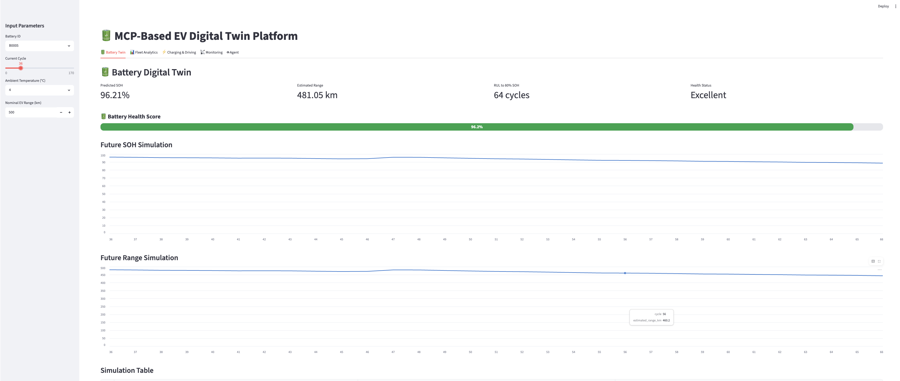
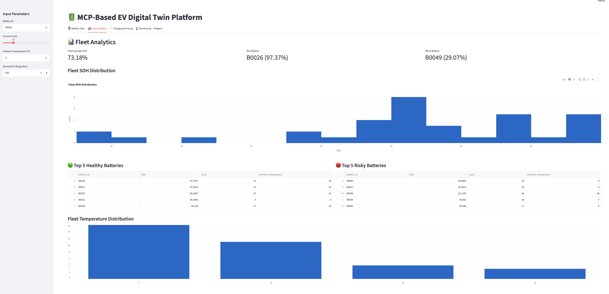
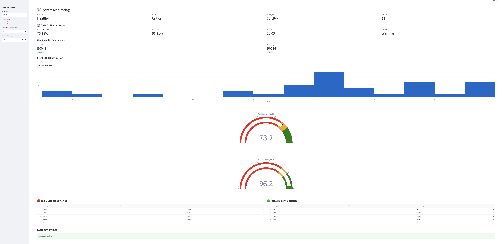

# 🔋 MCP-Based EV Digital Twin Agent with Gemma-Powered Tool Calling

An AI-powered EV Digital Twin platform that combines battery analytics, predictive maintenance, fleet monitoring, MCP-based tooling, and Gemma-powered intelligent decision support.

The system allows users to analyze battery health, estimate remaining useful life (RUL), monitor fleet-wide battery performance, detect data drift, and interact with EV analytics through a natural language interface.

---

## Dashboard Preview

### Battery Digital Twin



### Fleet Analytics



### Monitoring & Drift Detection



---

## 🚗 Key Features

### Battery Digital Twin

* State of Health (SOH) Prediction
* Remaining Useful Life (RUL) Estimation
* Battery Range Estimation
* Future Degradation Simulation
* What-if Scenario Analysis

### Charging Intelligence

* Charging Pattern Analysis
* Charging Risk Scoring
* Fast Charging Detection
* Battery Protection Recommendations

### Driving Intelligence

* Driving Style Analysis
* Energy Consumption Evaluation
* Vehicle Efficiency Insights

### Predictive Maintenance

* Maintenance Priority Assessment
* Maintenance Recommendations
* Battery Risk Identification

### Fleet Analytics

* Fleet Health Monitoring
* Healthiest Battery Detection
* Riskiest Battery Detection
* Fleet Status Evaluation

### Data Drift Detection

* SOH Drift Monitoring
* Fleet Stability Analysis
* Monitoring Dashboard

### Gemma-Powered Tool Calling Agent

The system includes a tool-calling EV assistant powered by Gemma.

Examples:

* Compare B0005 and B0047
* Which battery is the riskiest?
* Which battery is the healthiest?
* Why is B0047 riskier than B0005?

The agent automatically selects the appropriate analytical tool and converts the tool output into a professional EV engineering explanation.

### MCP Server Tools

Implemented MCP-compatible tools:

* `predict_future_soh()`
* `estimate_rul()`

The project includes MCP server infrastructure and tool-based EV analytics services.

---

## 🏗 Architecture

```text
User
 │
 ▼
Gemma Tool-Calling Agent
 │
 ▼
EV Digital Twin Engine
 │
 ├── Battery Twin
 ├── Charging Intelligence
 ├── Driving Intelligence
 ├── Predictive Maintenance
 ├── Fleet Monitoring
 ├── Drift Detection
 └── MCP Server Tools
 │
 ▼
Streamlit Dashboard
```

---

## 📊 Datasets

### NASA Battery Dataset

Used for:

* Battery degradation modeling
* SOH prediction
* RUL estimation

### EV Charging Patterns Dataset

Used for:

* Charging behavior analysis
* Charging risk assessment

### EV Telemetry Dataset

Used for:

* Driving intelligence
* Energy consumption analytics
* Vehicle efficiency evaluation

---

## 🛠 Technologies

* Python
* Streamlit
* Scikit-Learn
* Pandas
* Plotly
* Ollama
* Gemma 3
* MCP (Model Context Protocol)
* Machine Learning

---

## Installation

```bash
git clone https://github.com/mahmutcanborann/mcp-ev-digital-twin-agent.git

cd mcp-ev-digital-twin-agent

pip install -r requirements.txt
```

---

## Run Dashboard

```bash
streamlit run dashboard/app.py
```

---

## 🔮 Future Work

* Full MCP Client-Server Tool Orchestration
* Advanced Fleet AI Analyst
* Hugging Face Deployment
* Real-Time Vehicle Telemetry Integration
* Multi-Agent EV Diagnostics

---

## 👨‍💻 Author

Mahmut Can Boran

Computer Engineer | AI Engineer |

Areas of Interest:

* Automotive AI
* Digital Twins
* Agentic Systems
* Predictive Maintenance
* EV Software
* MCP Architectures
