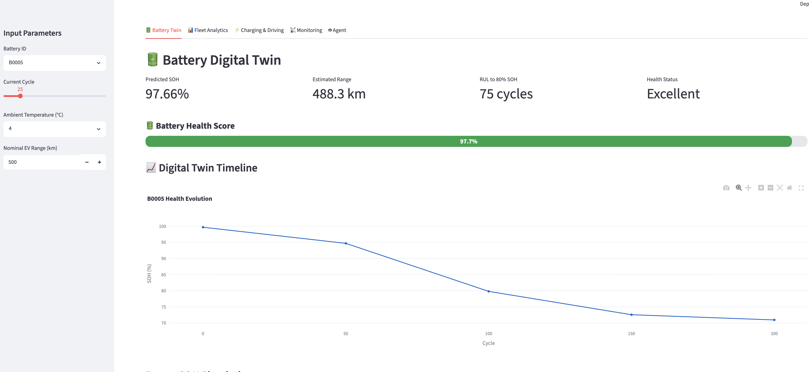
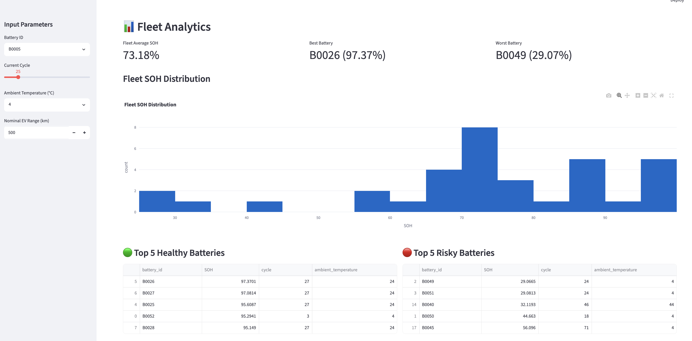
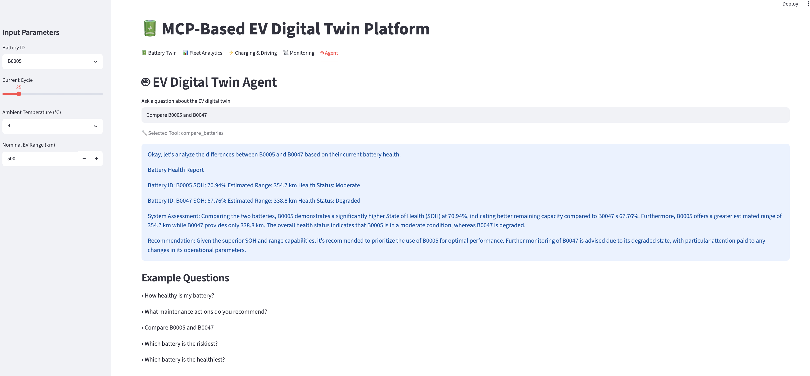

# 🔋 MCP-Based EV Digital Twin Agent


---

## 👨‍💻 Author

# **Mahmut Can Boran**

**AI Engineer | Automotive Software Enthusiast | Computer Engineer**

Passionate about Agentic AI, Model Context Protocol (MCP), Large Language Models, Digital Twins, and Intelligent Automotive Software Systems.

---

## 🚀 Overview

An AI-powered **EV Digital Twin** platform that combines **battery health prediction, fleet analytics, intelligent tool orchestration through the Model Context Protocol (MCP), and LLM-powered reasoning** to monitor, analyze, and explain electric vehicle battery behavior.

Unlike a traditional dashboard, this project dynamically discovers available MCP tools, selects the most appropriate tool using an LLM, executes engineering analyses, injects fleet-aware context, and generates structured battery health reports through multi-step reasoning.

---

# 🚀 Features

## 🔋 Battery Digital Twin

- Battery State of Health (SOH) Prediction
- Remaining Useful Life (RUL) Estimation
- Estimated Driving Range Prediction
- Battery Health Classification
- Digital Twin Timeline Visualization
- What-if Scenario Simulation

---

## 🚗 Fleet Intelligence

- Fleet-wide Battery Comparison
- Fleet Health Ranking
- Fleet Anomaly Detection (Isolation Forest)
- Battery Outlier Identification
- Data Drift Monitoring

---

## 🤖 Agentic AI

- Model Context Protocol (MCP) Integration
- Dynamic MCP Tool Discovery
- Automatic Tool Selection with Gemma
- Multi-Step Reasoning
- Fleet-aware Context Injection
- Engineering Report Generation
- Intelligent Tool Orchestration

---

## 📚 Battery Knowledge Base

The agent combines numerical battery predictions with engineering knowledge to explain:

- Battery degradation
- State of Health (SOH) interpretation
- Charging recommendations
- Battery maintenance suggestions
- Risk assessment
- Engineering-oriented battery reports

---

## ⚙️ Deployment

- Streamlit Dashboard
- Dockerized Deployment
- Hugging Face Spaces
- Git LFS Model Management

---

# 🏗️ System Architecture

```text
                     User Question
                           │
                           ▼
               Discovery MCP Agent
                           │
                           ▼
                Dynamic Tool Discovery
                           │
                           ▼
              Gemma Tool Selection
                           │
                           ▼
                    MCP Tool Server
                           │
      ┌──────────────┬──────────────┬──────────────┐
      ▼              ▼              ▼
 Battery Twin   Fleet Analytics   Driving Analytics
      │              │              │
      └──────────────┴──────────────┘
                     ▼
             Engineering Reasoning
                     ▼
           Battery Health Report
```

---

# 📊 Current Capabilities

| Module | Status |
|----------|:------:|
| Battery SOH Prediction | ✅ |
| Remaining Useful Life (RUL) | ✅ |
| Driving Range Estimation | ✅ |
| Battery Digital Twin | ✅ |
| Digital Twin Timeline | ✅ |
| What-if Scenario Simulation | ✅ |
| Fleet Analytics | ✅ |
| Fleet Anomaly Detection | ✅ |
| Data Drift Detection | ✅ |
| MCP Tool Calling | ✅ |
| Dynamic Tool Discovery | ✅ |
| Multi-Step Reasoning | ✅ |
| Battery Knowledge Base | ✅ |
| Docker Deployment | ✅ |
| Hugging Face Deployment | ✅ |

---

# 🛠️ Tech Stack

## AI / Machine Learning

- Scikit-learn
- Random Forest
- Isolation Forest
- Gemma LLM
- Ollama

### Agent Framework

- Model Context Protocol (MCP)
- FastMCP
- Dynamic Tool Discovery
- Agentic AI

### Backend

- Python
- Pandas
- NumPy
- Joblib

### Frontend

- Streamlit
- Plotly

### Deployment

- Docker
- Hugging Face Spaces
- Git LFS

---

# 📸 Demo

## Battery Digital Twin



---

## Fleet Intelligence





---

## Agentic AI Assistant



---

# 🔮 Roadmap

- Multi-Agent EV Architecture
- Vector Database Integration
- Retrieval-Augmented Generation (RAG)
- Real-Time Vehicle Telemetry Integration
- Predictive Maintenance Scheduling
- Fleet Decision Support System

---

# ⭐ Why this project?

This project demonstrates how **Model Context Protocol (MCP)**, **Agentic AI**, **LLMs**, and **predictive battery analytics** can be combined to build an intelligent EV Digital Twin capable of autonomous tool discovery, engineering reasoning, and fleet-level battery monitoring.

The project was designed to explore modern AI agent architectures while addressing real-world battery monitoring challenges in electric vehicles.

---

# 📬 Contact

**Mahmut Can Boran**

- 💼 LinkedIn: https://www.linkedin.com/in/mahmutcanboran/
- 💻 GitHub: https://github.com/mahmutcanborann

If you're interested in **Agentic AI, MCP, Digital Twins, Battery Analytics, or Automotive Software Engineering**, feel free to connect or reach out.